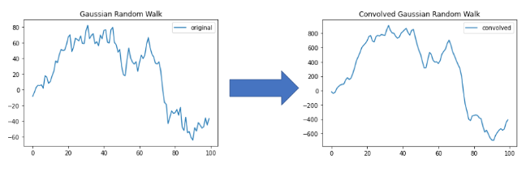

# Enhance the Stock Market Prediction Using Twitter Sentiment Analysis

## Contents:
* [Problem Formulation](#Problem-Formulation)
* [Background](#Background)
  * [Why CNN at time series?](#Why-CNN-at-time-series?)
  * [Why LSTM at time series?](#Why-LSTM-at-time-series?)
* [Methodology](#Methodology)
  * [The Project Structure](#The-Project-Structure)
  * [Dataset Collection](#Dataset-Collection)
  * [Data Preprocessing](#Data-Preprocessing)
  * [Sentiment Analysis](#Sentiment-Analysis)
  * [Data preparation](#Data-preparation)
    * [ARIMA Preparation](#ARIMA-Preparation)
    * [CNN-LSTM Preparation](#CNN-LSTM-Preparation)
  * [Modeling](#Modeling)
    * [CNN-LSTM Based approach](#CNN-LSTM-Based-approach)
    * [ARIMA (Autoregressive integrated moving average) approach](#ARIMA-(Autoregressive-integrated-moving-average)-approach)
* [Results](#Results)
* [Conclusion](#Conclusion)
* [Usage](#Usage)
  * [Scraping tweets ](#Scraping-tweets)
  * [Applying the Sentiment analysis on the tweets](#Applying-the-Sentiment-analysis-on-the-tweets)
* [References and Related Work](#References-and-Related-Work)
* [Team Members](#Team-Members)

## Problem Formulation:
The stock market is a focus for investors to maximize their potential
profits and consequently, the interest shown from the technical
and financial sides in stock market prediction is always on the rise.

However, stock market prediction is a problem known for its challenging
nature due to its dependency on diverse factors that affect 
the market. These factors are unpredictable and cannot be taken into
consideration, such as political variables and social media effects
like Twitter on the stock market.

## Background:

### Why CNN at time series?
> **Convolutional Neural Networks (CNN):**   
> The 1-D convolutional neural networks are used intensively in time series forecasting for a fixed window length. CNN has the ability to remove noise and unrelated patterns along the time series data. Also, the convolutional and pooling layers both perform smoothing to the data instead of the traditional weighted average, which requires manual tuning. 
>  
> Convolution learns from data through its filter’s weights update. CNN layers depend on the learning of the filters, so these filters after training will be able to detect features. 
>  
> The pooling layer mainly smooths out and reduces the local noise by averaging the time series values. 
>  
> The data changes after each layer: 
>  
> **Figure 1:** The change due to the CNN layer 
> **Figure 2:** The change due to the pooling layer 

### Why LSTM at time series?

> LSTM (Long Short-Term Memory) networks have the ability to learn long-term dependencies, especially in sequence prediction problems like time series. LSTM has outstanding performance on a large variety of data.
>  
> **Important Note:** The Bidirectional LSTM can learn in both directions, forward and backward sequences. Also, Bidirectional has complete information about all the points in the data.

## Methodology
### The Project Structure

As shown in the above figure, our project has nine stages:
- Stock Data Scraping
- Twitter & OilPrice.com Data Scraping, Preprocessing, and Sentiment analysis
- Modeling Using Two approaches:
  - Deep learning architecture using 1D-CNN and BiCudaLSTM layers as our new approach

### Dataset Collection
- **The Stock Data:** The research team downloaded the stock data of Netflix in a spreadsheet from Yahoo Finance.

- **The OilPrice.com and Twitter Data:** The research team scraped data within the same period using Selenium.

### Data Preprocessing
> After scraping the tweets, the text was unclean. So, we went through a cleaning process as follows:
> - Lowering the sentences.
> - Removing the attached links, hashtags, symbols, and numerical values.
> - Translating emojis into their meanings.
> - Tokenizing sentences by Twitter.
> - Removing stopwords and punctuation.
> - Applying lemmatization to each word.
> 

### Sentiment Analysis
> As the volume of tweets was large, it was a challenge to label them manually. The research team used a pre-trained model called “[Captain-1337/CrudeBERT](https://huggingface.co/Captain-1337/CrudeBERT)” which is a pre-trained NLP model to analyze sentiment in news headlines relevant to crude oil.
> 
> The polarity score was converted into three values: 1, 0, and -1 for each class. A value of 1 represents a positive tweet, 0 represents a neutral tweet, and -1 represents a negative tweet.

### Data Preparation
> The polarities were combined with the stock data to form one dataset, which was used in time series models.
> 

### Results
> LSTM Prediction of Open Price with sentiment analysis
> 
> LSTM Prediction of Adjusted Close Price with sentiment analysis
> 
